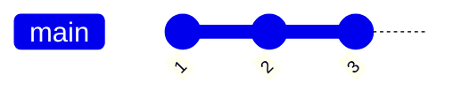
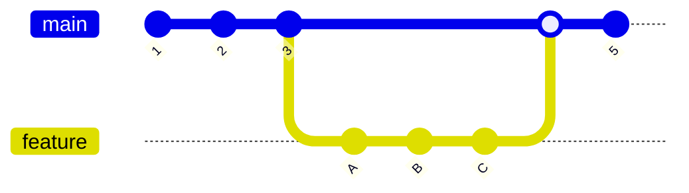
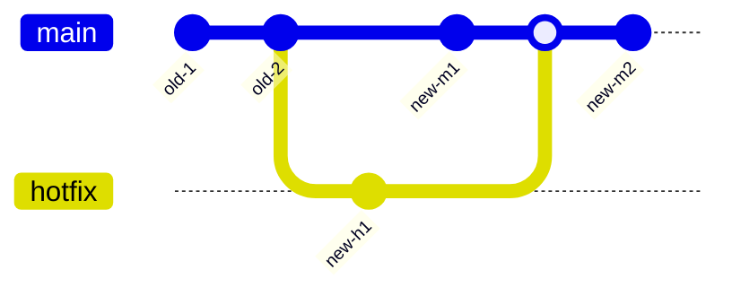
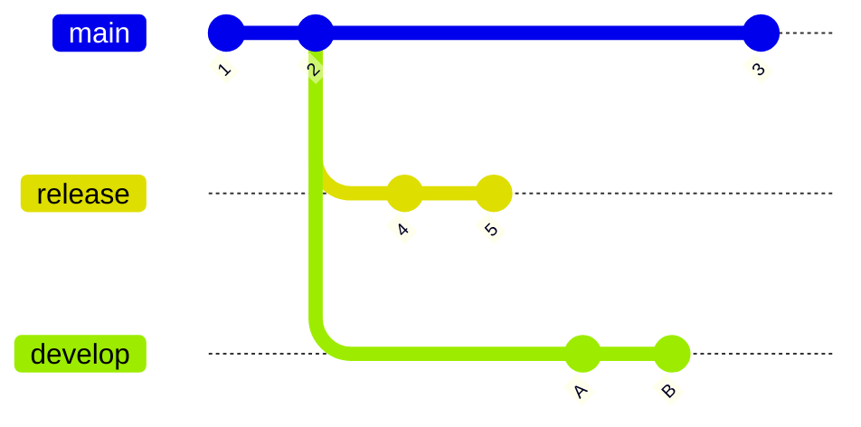

# Git Traversal Design

## Purpose

This document explains how gitrail traverses Git history and applies differential extraction in the current implementation.

Normative rules remain in `.github/instructions/git-traversal.instructions.md`.

## Why traversal is graph-based

Git history is a DAG, not a single list.

- A commit has parent links, but no branch field.
- A branch is a movable ref that points to one commit.
- The same commit can be reachable from multiple branches.

Therefore, branch extraction means traversing commits reachable from that branch head at run time.

## Adapter-level traversal model

The adapter traverses commits using manual BFS over parent links.

High-level steps:

1. Resolve branch ref to a head OID.
2. If an exclusion boundary exists, pre-compute all commits reachable from that boundary.
3. Traverse from head with a queue.
4. Skip commits already visited or excluded.
5. Yield each remaining commit to Core.

This design avoids relying on unsupported exclusion semantics in high-level library helpers.

## Differential extraction modes

### Full extraction

No state and no manual range options:

- Start at each configured branch head.
- Traverse full reachable history.

Visual:

Example BFS traversal result list:

- `[3, 2, 1]`

### Differential by state file

With `--state`:

- Core reads per-branch `lastCommitHash`.
- Each branch uses that OID as `excludeHash`.
- Traversal yields only the set difference: commits reachable from current head but not from `excludeHash`.

Equivalent mental model: `excludeHash..currentHead`.

Visual:

Interpretation for state-based differential:

- Assume `excludeHash = 3` from the previous run.
- Let `M` denote the merge commit created by `merge feature`.
- Newly included set is `{5, M, C, B, A}`.
- Already processed set is `{3, 2, 1}`.
- Example BFS traversal result list for this differential run: `[5, M, C, B, A]`

### Differential by commit object ID (OID) or ref

With `--since-ref`:

- CLI resolves the ref (tag, branch name, or full commit OID) to a commit OID via `resolveRef()`.
- Core passes the resolved OID as `excludeHash`.

Example traversal result list:

- Uses the same traversal behavior as state-based differential.
- For the visual above with `--since-ref 3` (or a tag pointing to commit 3), one BFS result is `[5, M, C, B, A]`.

Current runtime support is limited to repositories using the `sha1` object format. The object
format gate runs before traversal planning/state-boundary consumption. Unsupported formats fail
fast with:
`Unsupported repository object format: <format>. Supported formats: sha1.`

### Differential by date

With `--since-date`:

- Core traverses without `excludeHash`.
- Core filters yielded commits by committer timestamp.

Important behavior:

- Filtering uses `continue`, not `break`.
- Old commits are skipped, but traversal continues.

Reason: BFS graph order is not chronological, especially around merges. Early stop would miss newer commits reachable through another path.

Visual:

Interpretation for date-based filtering:

- Commits older than the boundary are skipped.
- Traversal still continues so `new-h1`, `new-m1`, and `new-m2` are not missed.
- Let `M` denote the merge commit created by `merge hotfix`.
- Representative BFS traversal list before date filtering: `[new-m2, M, new-m1, new-h1, old-2, old-1]`
- Representative output list after date filtering: `[new-m2, M, new-m1, new-h1]`

## Merge handling and exclusion correctness

Exclusion must operate on reachability, not simple encounter order.

If previous state is commit `3` and current head is `5` in a merged DAG, correct output includes commits added through both first-parent and merged branches after `3`.

By pre-computing the full reachable set from `excludeHash`, traversal correctly excludes prior history while preserving new merged commits.

## Deduplication strategy

### Within one run

Core keeps a global `visited` set across all configured branches.

Outcome:

- Shared history is written once, even if reachable from multiple branch heads in the same execution.

### Across runs

When a new branch is added to `--ref` in an incremental run, gitrail automatically deduplicates
against prior runs using **merge base computation**.

**Repository topology used in the examples below:**

Both `release` and `develop` branch from commit `2`. `release` and `main` advance independently
afterward; `develop` is the branch being added in Run 2.

**Why naive full traversal produces duplicates:**

- Run 1 uses `--ref main --ref release`.
- Run 1 output (session-deduplicated): `[3, 2, 1, 5, 4]`. State: `{ main: "3", release: "5" }`.
- Run 2 uses `--ref main --ref release --ref develop`.
- For `main`: differential from state OID `"3"` → no new commits in this example.
- For `release`: differential from state OID `"5"` → no new commits in this example.
- For `develop`: no prior state → without deduplication, full traversal yields `[B, A, 2, 1]`.
- Commits `2, 1` would be duplicated.

**How merge base deduplication prevents this:**

Before the per-branch traversal loop, gitrail identifies new branches (present in `--ref` args
but absent from the state file). If the state file already contains at least one branch, gitrail
calls `adapter.findMergeBase()` with the `lastCommitHash` values from the state file as `oids`.
The returned OID is used as `excludeHash` for all new branches, applying the same exclusion
mechanism used for existing branches in incremental extraction.

For the scenario above:

- `develop` is new. Existing state HEADs: `["3", "5"]` (from `{ main: "3", release: "5" }`).
- `findMergeBase(["3", "5"])` = commit `"2"` — the deepest common ancestor of `main` and `release`.
- `develop` traversal with `excludeHash = "2"` → yields only `[B, A]`. No duplicates. ✅

**Algorithm (pre-loop step):**

1. Identify new branches: present in `config.branches` but absent from `stateMap`.
2. If new branches exist and `stateMap.size > 0`:
   - Collect `existingHeads`: the `lastCommitHash` values from `stateMap` (the prior-run HEADs,
     not current HEADs — consistent with how existing branches use state values, and avoids extra
     `resolveRef()` calls).
   - Call `adapter.findMergeBase(repoPath, existingHeads)`.
   - If result is non-null: use as `excludeHash` for all new branches.
   - If result is `null` (no common ancestor): fall back to full traversal for those branches.
3. If `stateMap.size === 0` (first incremental run): no existing HEADs to compute against; all
   branches are fully extracted. This is the expected initialization behavior.

**Note:** only one merge base is computed regardless of how many new branches are added.
`findMergeBase` receives all existing HEADs at once; the result is the deepest common ancestor
across all of them, and the same `excludeHash` applies to every new branch.

**Fallback — no common ancestor:**

If `findMergeBase` returns `null` (e.g. an orphan branch with detached history), gitrail falls
back to full traversal for the new branch. Duplicate commits may appear in the output.

Recovery: discard prior output and re-run with `--mode snapshot` across all branches, then resume
incremental extraction.

## State file lifecycle

Core owns state management.

Read phase:

- Parse state JSON.
- Validate version.
- Validate repository identity with resolved absolute paths.

Write phase:

- Run completes output writing first.
- Write new state to temporary file.
- Rename temp file to target path atomically.

This prevents state advancement on partial output failures.

## Ordering guarantees

Current guarantees:

- Branch traversal follows CLI branch order.
- Commits from one branch are processed before the next branch starts.

Non-guarantees:

- JSONL line order is not chronological.
- Consumers must sort by timestamp downstream when chronological order is required.

## Error and recovery behavior

- Missing branch ref: warn and skip branch.
- Missing old state boundary commit: warn and fall back to full traversal for that branch.
- Non-repository path: fail fast during validation.

This approach prioritizes successful extraction with explicit warnings in recoverable scenarios.

## Performance characteristics

- Traversal is streaming-friendly and memory usage is mostly bounded by queue/visited sets.
- Exclusion set computation can be expensive for large histories because it may walk deep prior history.
- Session deduplication memory scales with number of unique traversed commits.

## Future enhancement candidates

- Progress and summary reporting tied to traversal counters.
- Heuristics to reduce exclusion set walk cost for very large repositories.

## References

- `.github/instructions/git-traversal.instructions.md`
- `src/core/extractor.ts`
- `src/git/isomorphic-git-adapter.ts`
